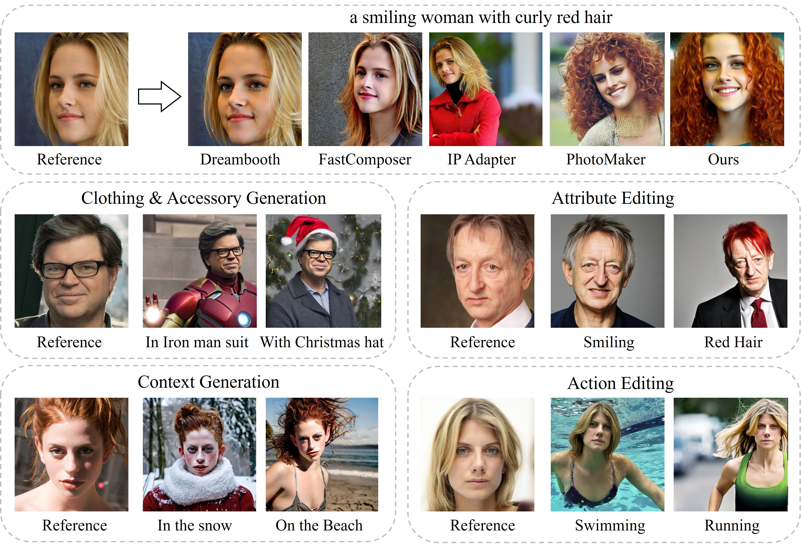
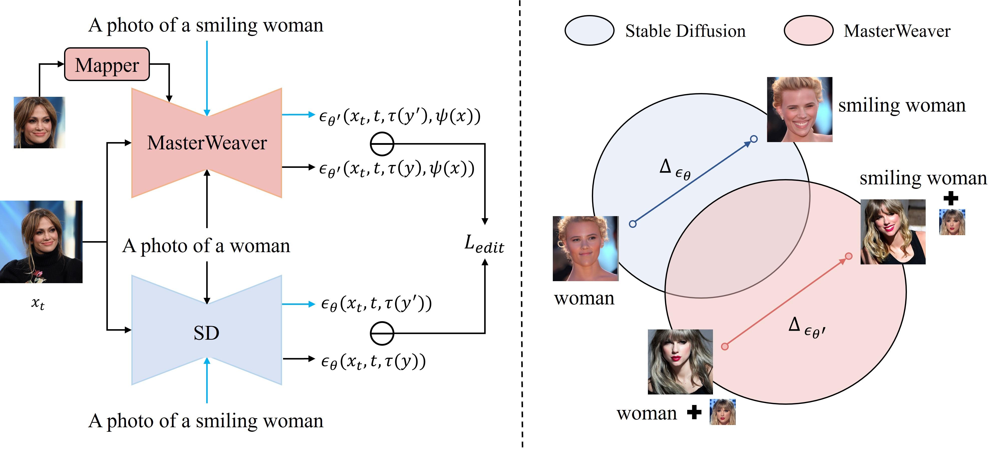

# MasterWeaver
MasterWeaver: Taming Editability and Identity for Personalized Text-to-Image Generation


[](https://arxiv.org/abs/2405.05806)
[](https://masterweaver.github.io/)




With one single reference image, our MasterWeaver can generate photo-realistic personalized images with diverse clothing, accessories, facial attributes and actions in various contexts.

## Method

--- 


**(a) Training pipeline of our MasterWeaver.**  To improve the editability while maintaining identity fidelity, we propose an editing direction loss for training. Additionally, we construct a face-augmented dataset to facilitate disentangled identity learning, further improving editability. **(b) Framework of our MasterWeaver.** It adopts an encoder to extract identity features and employ it with text to steer personalized image generation through cross attention.
  


By inputting paired text prompts that denote an editing operation, e.g., (a photo of a woman, a photo of a smiling woman), we identify the editing direction in the feature space of diffusion model. Then we align the editing direction of our MasterWeaver with that of original T2I model to improve the text controllability without affecting the identity.


## Getting Started

### Environment Setup

```shell
git clone https://github.com/csyxwei/MasterWeaver.git
cd MasterWeaver
conda create -n masterweaver python=3.9
conda activate masterweaver
pip install -r requirements.txt
pip install dlib==19.24.0
```

### Inference

Download the [dlib model](https://github.com/italojs/facial-landmarks-recognition/blob/master/shape_predictor_68_face_landmarks.dat) and the [face parsing model](https://drive.google.com/open?id=154JgKpzCPW82qINcVieuPH3fZ2e0P812), and place them in the `./pretrained` directory.

Download our [pretrained model](https://drive.google.com/file/d/1pzZfRIeaaEcfeiV9-wxWQ_BOiBZmSM9_/view?usp=sharing) and save it to the `./pretrained` directory.

Then, run the following command to perform inference:

```shell
# (optional for downloading model from huggingface)
# export HF_ENDPOINT=https://hf-mirror.com
python inference.py
```

We also provide the gradio demo, just run:

```shell
# (optional for downloading model from huggingface)
# export HF_ENDPOINT=https://hf-mirror.com
python gradio_app.py
```


### Training

Please first prepare the dataset following [instruction](https://huggingface.co/datasets/csyxwei/Filtered-Laion-Face).

After that, we train the first stage model by running the following command:

```shell
## (optional for downloading the huggingface model)
# export HF_ENDPOINT="https://hf-mirror.com"
export MODEL_NAME="runwayml/stable-diffusion-v1-5"
export DATA_DIR='/path/to/filtered_laion_faces/'
accelerate launch --num_processes 4 --multi_gpu --mixed_precision "no" train_masterweaver_stage1.py \
  --pretrained_model_name_or_path=$MODEL_NAME \
  --image_encoder_path="openai/clip-vit-large-patch14" \
  --data_root_path=$DATA_DIR \
  --mixed_precision="no" \
  --resolution=512 \
  --train_batch_size=4 \
  --gradient_accumulation_steps=4 \
  --max_train_steps=100000 \
  --learning_rate=1e-06 --scale_lr \
  --lr_scheduler="constant" \
  --lr_warmup_steps=0 \
  --dataloader_num_workers=16 \
  --output_dir="./adapter_experiments/masterweaver-stage1" \
  --save_steps=2000 \
  --vis_steps=200
```

Then, we tune the model using editing direction loss and the face-augmented dataset:

```shell
# (optional for downloading model from huggingface)
# export HF_ENDPOINT="https://hf-mirror.com"
export MODEL_NAME="runwayml/stable-diffusion-v1-5"
export DATA_DIR='/path/to/filtered_laion_faces/'
accelerate launch --num_processes 4 --multi_gpu --mixed_precision "no" train_masterweaver_stage2.py \
  --pretrained_model_name_or_path=$MODEL_NAME \
  --image_encoder_path="openai/clip-vit-large-patch14" \
  --adapter_path="./adapter_experiments/masterweaver-stage1/adapter_100000.pt" \
  --data_root_path=$DATA_DIR \
  --mixed_precision="no" \
  --resolution=512 \
  --train_batch_size=4 \
  --gradient_accumulation_steps=4 \
  --max_train_steps=100000 \
  --learning_rate=1e-06 --scale_lr \
  --lr_scheduler="constant" \
  --lr_warmup_steps=0 \
  --lambda_edit=0.02 \
  --dataloader_num_workers=16 \
  --output_dir="./adapter_experiments/masterweaver-stage2" \
  --save_steps=2000 \
  --vis_steps=200
```


## Citation

```bibtex
@inproceedings{wei2024masterweaver,
  title={MasterWeaver: Taming Editability and Face Identity for Personalized Text-to-Image Generation},
  author={Wei, Yuxiang and Ji, Zhilong and Bai, Jinfeng and Zhang, Hongzhi and Zhang, Lei and Zuo, Wangmeng},
  booktitle={European Conference on Computer Vision},
  year={2024}
}
```


## Acknowledgements

This code is built on [diffusers](https://github.com/huggingface/diffusers/) and [IP-Adapter](https://github.com/tencent-ailab/IP-Adapter). We thank the authors for sharing the codes.